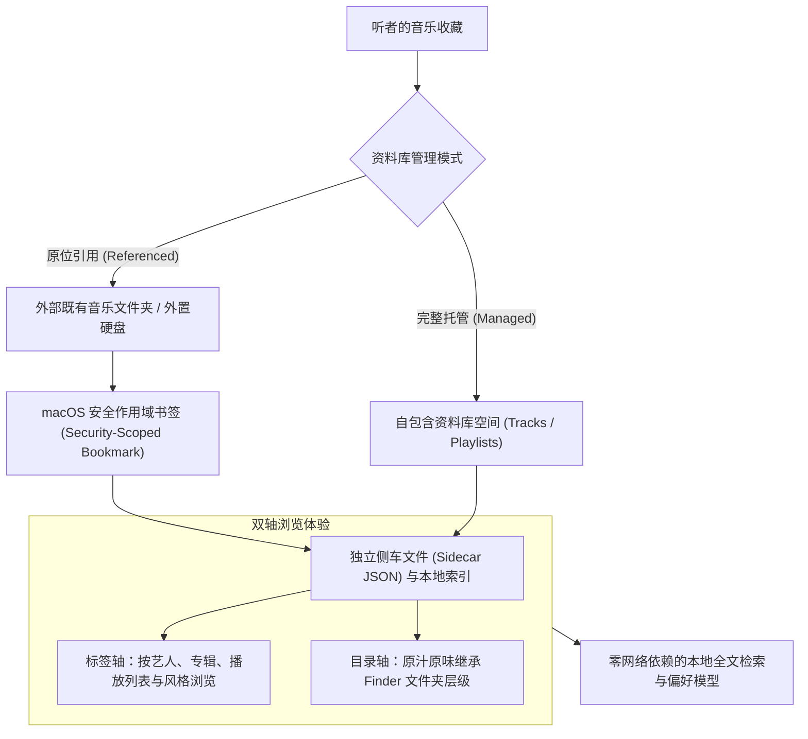

# 现代本地音乐资料库体系：架构、原位引用与设计哲学

对于许多习惯在本地收藏音乐的听者而言，硬盘中的音乐文件夹从来不只是一组冰冷的数据路径，而是数年甚至数十年间用心梳理的精神疆界。每一次分类、命名与归档，都凝结着听者独特的审美习惯与生活秩序。

在以往的数字音乐播放软件中，常见的设计往往偏向“专断”：应用在导入时强制将所有音频复制到其封闭的私有目录中，不仅凭空消耗双倍的存储空间，也强行抹平了用户在文件系统中建立的层级结构；更有甚者，还会擅自改写音频文件内嵌的元数据标签，令精心整理的收藏陷入混乱。

kmgccc_player 选择了截然不同的构建路径。我们始终相信，播放器应当是一扇澄澈明净的窗，真实映照出听者的音乐世界，而不是一个霸道地重塑一切的容器。为此，我们重新构建了面向未来的本地音乐资料库体系，将选择权与控制权完整归还给听者。

## 双模式架构：原位引用与自包含托管

为了兼顾不同用户的管理习惯，新体系确立了两种边界分明、各司其职的资料库工作模式：

### 1. 原位引用模式（Referenced Mode）

这是专为珍视自身文件秩序的音乐爱好者量身定制的模式。

用户只需将既有的音乐文件夹（哪怕存放于外置移动硬盘或网络挂载盘中）添加到资料库，播放器便会通过 macOS 的安全作用域书签（Security-Scoped Bookmark）建立持久而受限的读取凭证。在此模式下：

- **绝不改动原文件**：系统从不复制、重命名或覆写原始音频文件，甚至不会改变文件的最后修改时间；
- **侧车独立存储**：所有的元数据补全、歌词关联、自定义封面、播放计数与个性化调整，均作为独立的侧车数据（Sidecar JSON）存放在资料库目录内；
- **非破坏性变更**：即使用户从播放列表中移除某首歌曲，或彻底删除整个资料库，外部硬盘中的原始音频文件依然安然无恙，随时可供其他专业音频工具或归档软件完整读取。

### 2. 完整托管模式（Managed Mode）

针对希望资料库“自成一体”、便于单文件夹备份或在不同 Mac 设备间随身迁移的用户，托管模式在导入时会将音频文件规范有序地复制到资料库专属的 `Tracks` 目录中。

在托管模式下，资料库本身即是一个自足的数据岛屿，曲目实体、元数据索引、歌词与历史事件紧密结合。对于不想费心规划磁盘目录结构的用户，这是最为省心且易于归档的选择。

模式在资料库创建时选定并固化，杜绝了同一资料库中托管路径与外置路径混杂导致的数据混乱。

## 双轴并行浏览：打破标签与目录的隔阂

在现实的数字音乐世界中，元数据标签（ID3 Tag）并非总是整齐划一的。非公开发行的现场录音、古典乐章的特殊乐章命名、独立音乐人的 Demo 试听带或是游戏原声集，往往因为标签不规范，在传统的“艺人 / 专辑”分类法中变得零落散乱。

kmgccc_player 提出并实现了“标签轴与目录轴完全平行”的浏览架构：

- **标签轴**：面向元数据规范的常规曲库。通过统一的模型投射，用户可以按艺术家、专辑年代、流派风格与个性化播放列表展开全貌，享受现代流媒体般精致流畅的排版；
- **目录轴**：面向以文件夹为维度的直观检索。播放器完整保留了文件在 Finder 中的嵌套层级，支持逐层展开与下钻浏览。

这两条轴线并非孤立割裂的界面分支，而是同一批音乐资产在不同视角的投影。即便在目录轴中穿行，用户同样能够享受到封面提取、即时播放控制、动态主题着色与歌词渲染的完整体验，让习惯按文件夹归类的老唱片爱好者与偏好按专辑检索的新时代听者，都能找到最称手的旋律归属。

## 多资料库隔离（Multi-Library Architecture）

音乐往往映射着听者在不同情境下的心境与生活状态。书房专注时的轻音乐与古典管弦、通勤途中的流行脉动、深夜独处时的无损人声，若混杂在同一个庞杂的播放列表中，难免削弱聆听时的沉浸氛围。

新架构原生支持创建并管理多个独立资料库：

- **完全独立的数据生态**：每一个资料库均拥有专属于自己的根目录，内部独立维护配置设定、播放历史、偏好分析模型、全文检索索引与封面缓存；
- **串行安全的原子切换**：切换资料库时，系统严格执行生命周期流转——妥善落盘旧资料库的统计数据、释放文件访问租约、关闭后台扫描与监听队列，再平滑挂载新资料库的上下文。整个过程在毫秒级别无声完成，既无界面卡顿，亦无跨库数据污染之虞。

## 零网络依赖与纯粹的本地尊严

在云端流媒体盛行的当下，kmgccc_player 依旧恪守“本地优先（Local-First）”的准则。

从音频解码、封面色彩分析、全文检索索引（SQLite FTS5），到基于听觉行为习惯的偏好随机算法，所有计算均完全运行在用户的 Mac 本地。应用既不需要用户注册账号，亦绝不在后台向云端同步用户的曲目列表、文件指纹或目录结构。

你的音乐，完完全全属于你自己。技术在此退居幕后，只留下一片静谧、安全而忠诚的音乐空间，陪伴听者度过每一个值得托付给旋律的日常。
