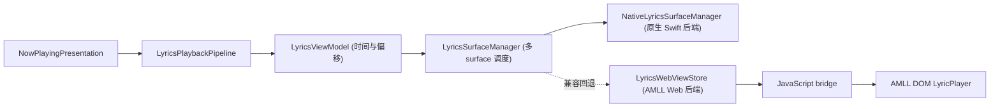

# 歌词渲染系统

> [!NOTE]
> 应用现已默认启用纯原生 Swift 歌词引擎（`NativeLyrics`），基于 Core Text 与 Core Animation 实现高刷新率排版与极低能耗。设计原理与原生渲染架构详见 [原生 Swift 歌词系统](native-lyrics.md)。本文档主要记录跨 surface 的统一调度生命周期、时间偏移预处理算法，以及保留作为兼容回退通道的 AMLL Web 渲染架构。

kmgccc_player 采用统一的分层调度管理多 surface 歌词显示。播放状态、颜色计算与 surface 生命周期始终由 Swift 原生层持有，核心原则是让渲染层专注绘制，而播放事实与界面切换统一收敛在服务层。



## 服务调度层与渲染后端的边界

服务调度层持有当前曲目、播放时间、播放状态、歌词文本、偏移设置和语义色。`LyricsPlaybackPipeline` 监听展示模型变化，把一次播放快照转换为歌词状态；`LyricsViewModel` 计算曲目偏移、全局提前量和 surface 配置；`LyricsSurfaceManager` 决定哪些 surface 处于活动状态，并分发给对应的渲染后端。

在默认的 `NativeLyrics` 原生后端中，歌词直接由 `NativeLyricsSurface` 承载，排版与动效直接在 Core Text 与 Core Animation 中完成，完全绕过浏览器运行时；在 AMLL 兼容后端中，`LyricsWebViewStore` 独立持有 WKWebView、ready 状态和可重放快照，Web 层仅负责执行渲染，不能反向成为播放状态的仲裁源。

## 多 surface 生命周期

窗口歌词、全屏歌词和预览歌词拥有各自独立的展示区域（surface）。无论后端处于原生模式还是 Web 兼容模式，`LyricsSurfaceManager` 都通过快照机制将当前歌词状态安全分发至活动中的目标 surface。

surface 切换遵循“先准备目标，再回收旧目标”的顺序：

1. 激活目标 surface；
2. 目标渲染容器（原生 Layer 树或兼容 WKWebView）ready 后重放当前快照；
3. 确认目标已经接管显示；
4. 延迟回收不再需要的旧 surface。

手动隐藏窗口歌词属于可见性变化，不等同于销毁 surface。持久 surface 会暂停渲染循环并保留 DOM；重新显示时只恢复现有行的位置和动画。真正切歌或新建 surface 才重新设置歌词行。

这个区分能避免两类常见问题：把手动显隐当成切歌，会造成重复入场；把切歌当成显隐恢复，则会让旧 DOM 与新歌词状态混在一起。

## 歌词入场与重新显示

新歌词或新 surface 使用 AMLL 的完整入场链路：

```text
setLyricLines(lines, initialTime)
  → setCurrentTime(initialTime, true)
  → calcLayout(true, false)
  → 为每个歌词行设置弹簧目标位置
```

已经存在的歌词重新显示时，不重新创建行对象。适配层先调用 `setCurrentTime(currentTime, false)`，再调用 `calcLayout(false, false)`，让 AMLL 根据当前位置重新计算弹簧目标。`force` 布局或直接写入弹簧位置会跳过过渡，不适合这条路径。

配置必须先于新歌词投递。字体、对齐和弹簧参数若在 `setLyricLines` 之后才到达，歌词会先按默认参数入场，再发生一次可见修正。

## 时间偏移

系统区分单曲校准偏移和全局视觉提前量：

```swift
trackOffsetMs = clamp(track.lyricsTimeOffsetMs, -15000, 15000)
globalAdvanceMs = clamp(settingsAdvance + runtimeAdvance, -5000, 5000)
timeOffsetMs = clamp(trackOffsetMs - globalAdvanceMs, -20000, 20000)
seekTimeOffsetMs = trackOffsetMs
```

`timeOffsetMs` 改变歌词行与逐词时间，用于视觉显示；`seekTimeOffsetMs` 只包含单曲校准，因为点击歌词后的跳转必须回到音频的实际位置。全局提前量用于补偿感知延迟，不能改变音频事实。

TTML 解析后，Web 层先基于原始行起点和 `seekTimeOffsetMs` 保存跳转表，再应用视觉偏移和提前切行。若顺序颠倒，点击歌词会把视觉提前量重复带入 seek。

## 临近切行算法

逐词歌词常出现两行首尾紧接的情况。若严格等到上一行结束才切换，下一行会显得迟钝；若简单把所有行统一前移，又会制造并不存在的并行歌词。系统先计算原始间隔：

```text
rawGap = currentRawStart - previousRawEnd
hasOriginalOverlap = rawGap < 0
isNearSwitch = !hasOriginalOverlap && rawGap <= nearSwitchGapMs
```

处理规则如下：

| 原始关系 | 当前行起点 |
| --- | --- |
| TTML 已有真实重叠 | 保留重叠语义，在安全范围内应用提前量 |
| 间隔小于临近切行阈值 | 使用配置的 `leadInMs` 提前进入 |
| 普通相邻行 | 最多提前 1000 ms，并且不早于上一行结束 |

所有行起点都处理完后，系统才统一裁剪上一行的结束时间。延后裁剪很重要：若在反向遍历中边改起点边截断上一行，后续判断会读到已经修改过的结束时间，原本首尾相接的两行可能被误判为重叠。

行起点提前后，只给行首前两个有意义的词或字符增加较小的逐词提前量。这样当前行不会在提前出现后完全静止，也不会把整行所有词统一平移，破坏原始逐词节奏。

## 时间不变量

- 视觉偏移可以改变显示时间，不能改变点击歌词后的实际跳转位置。
- 原始 TTML 没有重叠时，临近切行不得制造新的前景并行组。
- 原始 TTML 有真实重叠时，清理逻辑不得抹掉作者表达的并行关系。
- 背景行跟随主行时间，但不能独立制造前景重叠。
- 退出行高亮补完只是视觉补偿，不能成为时间事实来源。
- 暂停、seek 和普通播放必须走可区分的状态路径；seek 不执行退出高亮补完。

## AMLL Web 兼容渲染性能

在启用 AMLL 兼容模式时，WKWebView 的帧循环只在播放或动画尚未稳定时持续运行。暂停后保留一个短暂的收敛窗口，随后停止 `requestAnimationFrame`；新的 bridge 调用、可见性变化或配置更新会重新唤醒渲染器。原生 `NativeLyrics` 则直接由 Core Animation 与硬件垂直同步驱动，无此限制（详见 [原生 Swift 歌词系统](native-lyrics.md)）。

歌词性能问题通常来自透明 WebView、持续帧循环、根节点阴影、混合模式、模糊滤镜或重复重建 DOM。诊断时先确认 surface 是否被反复创建、同一快照是否重复投递，以及暂停后帧循环能否真正停下。

## 设计要点

- 播放内容由展示模型发布，视图只报告可见性。
- WKWebView 由 store 持有，不能回到视图自行创建的模式。
- surface 切换与手动显隐是两种生命周期。
- Web 层消费 Swift 给出的语义色，不自行重新分析封面。
- timing 变更要同时验证窗口、全屏、seek、暂停、重叠行和 lead-in，单一视觉样本不足以证明算法正确。
