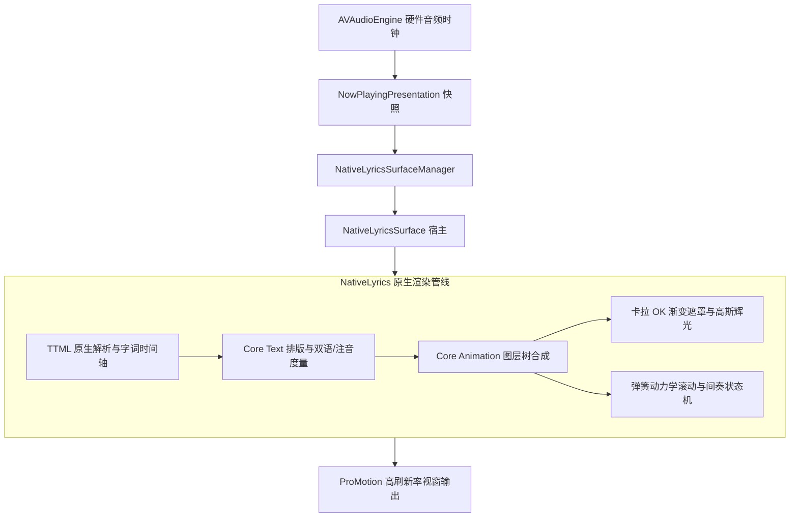

# 原生 Swift 歌词系统：设计哲学、排版与动效

音乐不仅是被听见的，也是在目光掠过字句起伏时被看见的。当旋律在耳畔展开，歌词承载着创作者的心迹，亦是听者唤起情感与记忆的印记。

在早期的设计中，逐字动效往往依赖内嵌网页视图（WebView）呈现。虽然该方案能够快速借鉴前端生态的动画效果，但在 macOS 这一强调能效、系统响应与精致视窗质感的桌面环境中，跨进程渲染带来的内存驻留、冷启动等待以及偶发的发热，难免在无形中打扰了纯粹的聆听体验。

为了让文字以最贴合 macOS 的方式自由呼吸，kmgccc_player 推出了全新的原生 Swift 歌词组件——`NativeLyrics`。它以 Core Text 的精致排版为骨骼，以 Core Animation 的平滑管线为脉络，使文字渲染直接扎根于原生视窗图层之上，在重现印刷品般排版质感的同时，带来了与声音节奏严密咬合的动效体验。

## 设计哲学：让文字拥有呼吸与重量

许多歌词渲染工具容易陷入两个极端：要么将文字视作单纯的逐行文本跳动，显得机械刻板；要么堆砌过于繁复的光影滤镜，喧宾夺主。`NativeLyrics` 在设计之初，确立了三项朴素而坚定的准则：

1. **文字先于动效**：歌词首先是一篇值得静心阅读的诗文。字体的间距、行高的比例、断句的舒适度，永远排在花哨的动效之前。
2. **动势顺应声律**：视觉的变化不是自我展示的舞台，而应当作为听觉的自然延展。音节长则光泽舒展，鼓点促则收放利落。
3. **退居背景的轻盈**：优秀的界面应当让人感受不到技术的阻隔。更低的能耗、更轻的系统负载，是技术对听者最长情的尊重。

## 文字排版与多语言呈现（Core Text）

文字排版直接调用 macOS 系统底层的 Core Text 框架。相较于浏览器引擎的通用排版流程，Core Text 能够更为精细地处理字体度量（Font Metrics）、基线对齐（Baseline Alignment）与字符包围盒：

- **智能换行与避头尾**：对于包含中、英、日、韩等多语言混合的歌词行，引擎能够精确识别标点禁则与断行边界，避免在行首出现收尾标点或在单字处生硬折行。
- **双语与平假名注音（Ruby Text）**：针对包含发音标注与翻译的曲目，排版引擎会在主歌词上方与下方以微缩字号优雅排布注音文本，并始终与对应字词保持居中锚定，无论视窗宽度如何拉伸，层级结构均整然不乱。
- **字阶与权重过渡**：未播放行保持克制的中灰与适度通透，随乐句临近而逐渐凝聚视觉重心；播放完毕的文字则以渐进的柔和阻尼淡出焦点，既维持了全篇的可读性，又不会分散听者对当下的专注。

## 逐字呼吸与动力学动画（Core Animation）

为了摆脱传统定时器轮询带来的微小颤动，`NativeLyrics` 构建了专属的图层渲染管线：

### 卡拉 OK 轮廓遮罩与光晕

字词的逐步点亮并非生硬的矩形切分，而是基于矢量字形轮廓的平滑行进。渲染层根据当前微秒级时间片计算填充比率，利用图层遮罩（CALayer Mask）使高亮色彩温润地滑过字迹。

在伴随高亢或长音延展的唱段中，字间会泛起经过轻微散射的高斯光晕（Glow Effect）。这种光晕直接在 GPU 图层中合成，柔和通透，既赋予歌词如同黑胶唱片封套般温润的质感，又避免了边缘溢色造成的视觉疲劳。

### 弹簧动力学与间奏呼吸感

当歌词行需要向前推移或居中校准时，系统彻底弃用了均速或生硬的贝塞尔缓动，引入了贴合真实物理世界的弹簧模型（Spring Dynamics）：

- 正在唱响的行如同受到引力牵引，以富有弹性的姿态柔顺地进入视线中央；
- 周遭的歌词行则如同受到轻微挤压的水波，以微妙的惯性向上下两侧推移散开；
- 当遇到长达数十秒的纯乐器演奏时，界面会自动收拢行间张力，缓缓浮现出节奏规整的间奏倒计时点，为听者提示旋律的段落起伏，并在下一句人声到来前的预备节拍中自然隐退。

## 音频时钟的微秒级同步

在数字音乐播放中，界面的推进最忌讳与声音脱节。哪怕数十毫秒的视听偏差，也会让敏锐的听者产生抽离感。

`NativeLyrics` 将渲染驱动直接锚定在 `AVAudioEngine` 的硬件时钟输出上：

- **零跨进程延迟**：以往由主进程向 Web 渲染进程发送 IPC 消息时，容易受到系统调度与消息队列积压的干扰；如今播放管线与视窗图层位于同一原生线程空间，时间采集与图层重绘紧密联动。
- **无感度的进度跳转（Seek）**：当用户在时间轴上快速拖拽寻道时，引擎能够在下一次垂直同步信号到达前完成文字重排与弹簧重置，消除传统方案中常见的画面回弹、闪烁或文字错位。

## 能耗、静谧与高帧率视界

将歌词渲染迁回原生环境，带来最立竿见影的改变是系统资源的释放：

| 指标维度 | 传统 Web 容器方案 | NativeLyrics 原生方案 | 体验提升 |
| --- | --- | --- | --- |
| **典型内存占用** | 约 150MB ~ 300MB（独立渲染进程） | 约 15MB ~ 30MB（共享应用图层） | 内存常驻减少约 90%，多窗口无压力 |
| **全屏动效 CPU 占用** | 8% ~ 18% | 1% ~ 3% | 显著减少发热，长时间播放风扇静音 |
| **冷启动就绪时长** | 800ms ~ 1500ms（DOM 初始化） | < 50ms（原生图层瞬时挂载） | 视窗打开即见歌词，无白屏或加载等待 |
| **最高支持刷新率** | 易受 WebKit 调度限制在 60Hz | 完美契合 ProMotion 120Hz | 在现代 Mac 屏幕上动效顺滑如丝 |

在支持 ProMotion 自适应高刷新率的屏幕上，每一帧歌词的渐变与行级的滑移都能够充分释放 120Hz 的平滑优势；而在歌词静止或暂停播放时，图层自动休眠，能耗趋近于零。

## 架构共存与兼容策略

为了保障升级过程的稳妥可靠，现有的 AMLL 渲染链路并未被生硬移除，而是作为稳定的回退通道继续存在。用户可在播放偏好设置中自由切换原生渲染与传统 Web 渲染；`LyricsSurfaceManager` 作为统一的门面，对上层视图屏蔽了底层引擎的差异，确保窗口歌词、全屏视窗与微型悬浮窗（MiniPlayer）在任何环境下都能获得一致的交互体验。
