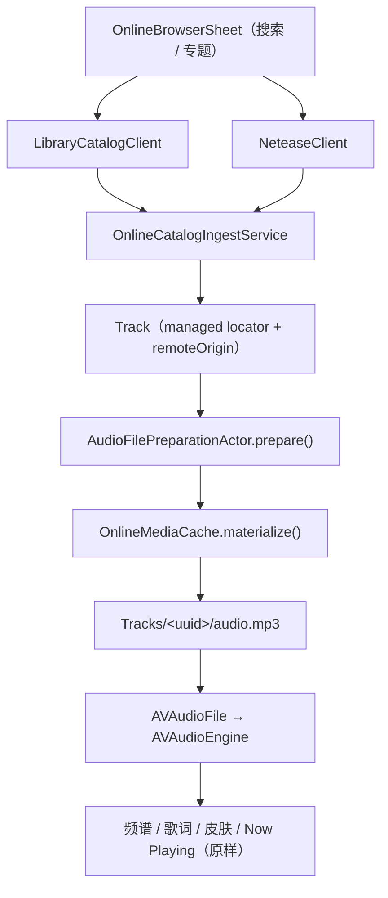

# 在线曲库与网易云

这个分支给播放器接了两个在线来源：自建曲库（经由运营方自己的服务）和网易云音乐（听众自己扫码登录）。两者共用同一条落地路径——**先把音频取成资料库里的真实文件，再走原来那条本地播放链路**。

## 为什么是下载而不是流式播放

播放链路建立在 AVAudioEngine 上：`AudioFilePreparationActor` 打开 `AVAudioFile`，`AVAudioPlaybackService` 调度它的 buffer，`AudioAnalysisHub` 在同一张图上取 tap 做实时频谱。

`AVAudioFile` 打不开 http URL。另起一条 AVPlayer 的路意味着重写调度、无缝衔接和分析 tap，而且**拿不回实时频谱**——那是这个播放器的招牌之一。

先把字节取下来，整条下游就一行都不用改：拖动进度、无缝衔接、频谱、歌词时间轴、Now Playing、皮肤、全屏、Dock，在线的歌和本地的歌走的是同一段代码。

代价是开头要缓冲一下（320kbps 的三分钟歌大约 7 MB）。

## 落点只有一个

`AudioFilePreparationActor.prepare()` 的第 0 步。它本来就是 actor、本来就在主线程外跑，取字节塞在解析之前正好。

本地曲目的 `remoteOrigin` 是 `nil`，这一步直接返回——本地资料库的行为一步没变。

## 为什么不给 TrackMediaLocator 加 `.remote`

`TrackMediaLocator` 说的是「音频在磁盘的哪里」；来源是另一回事。把两者混在一起会打断十几处对它的 exhaustive switch（导入放置、库模式迁移、扫描器、仓库、设置页文案）。

所以来源单独挂在 `Track.remoteOriginData` 上（JSON，和 `ncmConversionAssociationData` 一个写法），locator 照旧是 `.managed("Tracks/<uuid>/audio.mp3")`。文件还没下下来时 `availability` 用现成的 `.notDownloaded`——这个状态本来就是给「路径有效但内容不在本地」准备的，语义正好对上。

## 网易云是原生实现

扫码那两条（`login/qrcode/unikey`、`login/qrcode/client/login`）和取音源那条（`song/enhance/player/url`）都是明文 GET，不需要 weapi/eapi 加密。所以不必再往 bundle 里塞第六个 helper 进程。

登录的是**听众自己的账号**：每个人扫自己的码，会员歌曲能不能听按各自的账号算。cookie 按本项目已有的规矩存成 0600 文件（`Application Support/<bundleID>/Online/netease-account.json`），不进钥匙串——和 `TelemetrySigningKeyStore` 同一个路子，不需要额外 entitlement，本地构建也不会每次弹钥匙串。

网易云的音源 URL 带签名会过期，所以 `RemoteAudioOrigin.streamURLHint` 对网易云只在 20 分钟内复用，过了就重新去要一次。自建曲库那边是稳定地址，直接用。

取音源时**先匿名试一轮**，拿不到再用 cookie：大部分歌匿名就有，这样能让账号少碰限流器（`-462` 是账号级的临时限制，换号也没用）。

## 曲库走运营方自己的服务

`LibraryCatalogClient` 打的是 `/api/app/*`，不是上游 `api.ulunix.cn`。那台服务已经处理掉了上游列表接口的分页和字段缺口，并且持有本地快照和多写法搜索索引；上游 token 也不会因此散到每台装了 app 的机器上。

地址和口令在「设置 › 在线音乐」里填。

## 音频缓存

取下来的字节就放在在线资料库自己的 `Tracks/` 下，和托管资料库的布局一致。超过设置里的上限时，按最久未播放（`contentAccessDate`）逐个删——只动 `audio.*`，不碰元数据、封面和歌词。

目录遍历放在 detached task 里：`FileManager` 的枚举器不能在异步上下文里迭代，而且大库不该卡住下一首的启动。

## 歌词

两边的歌词都是 LRC 原文，交给已有的 `LRCConverterService.convertToTTML()` 转成 TTML 后写进 sidecar。原生歌词渲染走的还是原来那条路，没有第二个解析器。

## 改动清单

新增（都在同步目录下，不用改 pbxproj）：

- `Services/Online/OnlineCatalogModels.swift`
- `Services/Online/NeteaseClient.swift`
- `Services/Online/NeteaseAccountStore.swift`
- `Services/Online/LibraryCatalogClient.swift`
- `Services/Online/OnlineMediaCache.swift`
- `Services/Online/OnlineCatalogIngestService.swift`
- `Views/Online/OnlineBrowserSheet.swift`
- `Views/Settings/Online/OnlineSettingsView.swift`
- `Views/Settings/Online/NeteaseQRSignInSheet.swift`

改动：

- `Models/Track.swift` — 加 `remoteOriginData`
- `Models/AppSettings.swift` — 服务地址、口令、缓存上限
- `Services/Audio/AudioFilePreparationActor.swift` — prepare 前取字节
- `Services/Audio/AVAudioPlaybackService.swift` — `makePrepRequest` 带上 `remoteOrigin`
- `ViewModels/LibraryViewModel.swift` — `ingestOnlineSongs`
- `ViewModels/UIStateViewModel.swift` — 在线面板的开关
- `Views/Sidebar/SidebarView.swift` — 挂面板（和设置面板同一个宿主）
- `Views/Settings/SettingsCategory.swift` / `SettingsView.swift` — 设置多一页
- `kmgccc_playerApp.swift` — 文件菜单多一项
- `Info.plist` — ATS 例外（网易云有些 CDN 还是 http，曲库地址是用户自己填的）

## 界面

除了「在线音乐」这个面板，没有新画面。导进来的歌就是普通 `Track`，所以所有歌曲、歌手、专辑、播放列表、搜索、Now Playing、歌词、频谱、全屏全部照原样工作。

面板本身也是用现成的组件拼的（`SettingsHeaderLabel` / `SettingsSection` / 标准控件），照着 `ExternalPlaybackSettingsView` 的样子。
